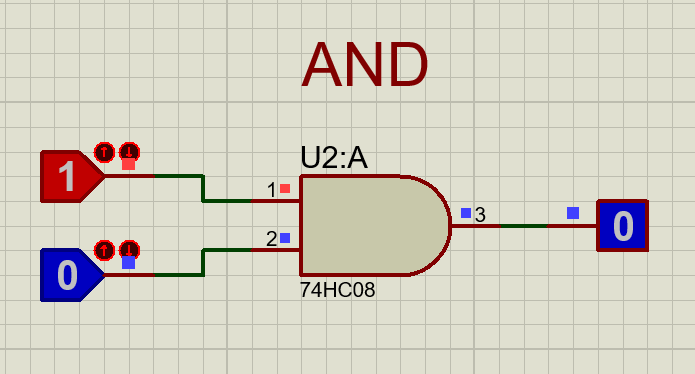

# LABORATORIO N°1
# Integrantes: 
  Edwin Stiven Pasto / Julian Romero Bocanegra
# Docente: 
  Diego Alejandro Barragán Vargas
# Institución: 
  Fundación Universitaria Compensar.

# Introducción
El informe documenta el desarrollo y los resultados obtenidos en el primer laboratorio implementado en Sistema Digitales. Este laboratorio se focaliza en la implementación y análisis de circuitos en electrónica digital, por ejemplo, el oscilador multivibrador como mediador, el temporizador TL555, la identificación de compuertas lógicas y el diseño de un sistema hexadecimal por medio de un display. Con la implementación de este ejercicio, se busca fundamentar y validar los conocimientos conceptuales de la lógica booleana y el comportamiento de la señal digital en el tiempo.

# Punto 1 | Onda Digital:
  El objetivo del primer punto de este laboratorio es diseñar y construir un oscilador astable con el uso del temporizador TL555. Este circuito se caracteriza por no tener un estado estable; su salida se conmuta constantemente entre el alto y el bajo de voltaje, generando así una onda cuadrada continua.
  
# Esquema: 
Diagrama de montaje de un circuito eléctrico para generar la onda mediante el 555.

Referencia: (Cómo Construir un Oscilador con un Temporizador 555 (en Modo Astable). (n.d.). https://www.learningaboutelectronics.com/Articulos/Oscilador-con-un-temporizador-555-modo-astable.php#google_vignette)

# Componentes: 
La lista de comonente se clasifica en activos y de control, pasivos y fuente de energia:
# Componentes Activos y de Control
U2 (Temporizador 555): Es el corazón del circuito, con la configuración  de multivibrador astable lo cual nos permite  generar la señal cuadrada (señal digital).
U1 (Regulador de Voltaje 7805): Reducir y estabiliza el voltaje de entrada a 5V o 9Vencargado de la alimentación del circuito.
D1 (LED-RED): Un diodo emisor de luz de color rojo (Bombillo LED) el cual es nuestro indicador de la oscilación de salida de 2 segundos.
  
# Componentes Pasivos (Resistencias y Capacitores)
R1 (Resistencia): Valor de 1k\Omega.
R2 (Resistencia): Valor de 6.2k\Omega.
C1 (Capacitor Electrolítico): Valor de 220\muF, utilizado para el filtrado.
C2 (Capacitor Electrolítico): Valor de 220\muF; este es el componente clave que, junto con R1 y R2, permite determina el periodo de oscilación de 2 segundos.
  
# Fuente de Energía y Conexión
B1 (Batería): Fuente de alimentación de 9V o 5V o	Terminal de Tierra (GND): Punto de referencia común.

# Simulación en Proteus

Referencia: (Elaborado por Edwin stiven pasto y Julian felipe Romero)

# Montaje Fisico

# Punto 2 | Compuertas Logicas: 
El objetivo del punto #2 es reconocer la caracterización técnica de las compuertas lógicas AND, OR, NOT, NAND, NOR y XOR. A través de este ejercicio, se busca validar las funciones booleanas y su comportamiento directo en circuitos integrados reales, identificando sus salidas y sus diferentes combinaciones de entrada.

# Esquema

# Componentes
Los componentes usados tanto en el cirucito logico como en el fisico son:
Compuerta AND: Circuito Integrado 74HC08 o 74LS08.
Compuerta OR: Circuito Integrado 74HC32 o 74LS32.
Compuerta NOT: Circuito Integrado 74HC04 o 74LS04.
Compuerta NAND: Circuito Integrado 74HC00 o 74LS00.
Compuerta NOR: Circuito Integrado 74HC02 o 74LS02.
Compuerta XOR: Circuito Integrado 74HC86 o 74LS86.

# Simulacion en proteus
Compuerta AND

Compuerta OR
Compuerta NOT
Compuerta NAND
Compuertas NOR
Compuertas XOR

# Montaje Fisico

# Punto 3: 
El tercer punto es el diseño y construcción de un sistema decodificador combinacional. Este sistema nos permite convertir la entrada de un formato binario de 4 bits en una salida visual, por medio de un display de 7 segmentos. El principal recto es la traducción utilizando meramente compuertas lógicas.

# Lógica: 
# 1). La Entrada: (Binario)
1.1). Se le entregas al sistema un número binario usando 4 interruptores (D, C, B, A).
1.2). Cada interruptor solo puede estar en 0 (apagado) o 1 (encendido).
1.3). Se tienen 4 interruptores, esto quiere decir que se pueden llegar hacer 16 combinaciones diferentes (desde el 0000     hasta el 1111).
# 2). El Procesador:  
Esa combinación de ceros y unos entra a una red de compuertas lógicas.
2.1). Pensemos en las compuertas como caminos con reglas: "Si el interruptor A y el B están encendidos, deja pasar la corriente".
2.2). Este "cerebro" decide, según la combinación, qué partes del display deben brillar y cuáles no.
# 3). La Salida: 
3.1). El display tiene 7 barritas de luz (llamadas de la a a la g).
3.2). Si se pone 0000 en los interruptores, el "cerebro" manda corriente a las barritas exteriores para dibujar un 0.
3.3). Si pones 1010 (que es el número 10), el cerebro activa las barritas necesarias para dibujar la letra A.
    
# Tabla de Verdad: 
Por medio de la tabla de verdad se relaciona cada segmento del display para su reprsentacion hexadecimal

Referencia: (Elaborado por Edwin stiven pasto y Julian felipe Romero) 

# Esquema: 
Diagrama de montaje de circuito eléctrico para la creación de la onda por medio del 555.
 
Referencia:  (Cómo Construir un Oscilador con un Temporizador 555 (en Modo Astable). (n.d.). https://www.learningaboutelectronics.com/Articulos/Oscilador-con-un-temporizador-555-modo-astable.php#google_vignette)

# Componentes
Para este montaje se necesita los siguientes elementos:
Compuertas NOT (74LS04): Para obtener las negaciones de las entradas.
Compuertas AND de 2 y 3 entradas (74LS08 / 74LS11): Para realizar los productos de los mapas de Karnaugh.
Compuertas OR (74LS32): Para sumar los términos y enviar la señal final a cada segmento.
Display 7 Segmentos Cátodo Común: El elemento de visualización final.Resistencias de 330-Omega: Siete unidades para proteger cada segmento del display.

# Simulacion proteus

# Montaje Fisico

# Conclusiones 

# Validación de la Oscilación Astable: 
Se comprueba que el temporizador 555 nos permite la generación de señales cuadradas, mediante la experimentación y las combinaciones de R1 = 1 kΩ, R2 = 6.2 Ω y C = 220 µF.
# Importancia de la Regulación de Voltaje: 
El implementar el regulador lm7805 es fundamental para la entrada del voltaje, esto mismo nos asegura la protección de los circuitos integrados.
# Eficacia de la Lógica Combinacional: 
El desarrollo del conversor binario a hexadecimal demostró que es posible reemplazar integrados especializados mediante el diseño de una matriz de compuertas lógicas básicas (AND, OR, NOT), logrando la visualización correcta de los 16 caracteres (0-F) en un display de 7 segmentos.

# Recomendaciones
# Gestión de Conexiones en Protoboard: 
Para el punto 3, lo recomendable es realizar el montaje de manera modular, probando segmento por segmento (del 'a' al 'g') antes de terminar el circuito por completo, debido a la alta densidad de cableado que dificulta la revisión de errores.
# Uso de Resistencias de Protección:
Es obligatorio incluir resistencias (preferiblemente de 220 a 330) en cada segmento del display y probar previamente todo para evitar sobrecargas que puedan dañar los LEDs del display o las salidas de las compuertas lógicas.

# Verificación de Fichas Técnicas: 
Antes de energizar, es importante revisar los datasheets de cada uno de circuitos integrados, especialmente en compuertas como la NOR (74LS02), cuya distribución de pines suele ser diferente al estándar de otras compuertas.

## Referencias y Atribuciones
* **Simulación:** Diseño desarrollado en Proteus Design Suite v8.13 / v9.1
* **Licencia:** Este proyecto se distribuye bajo fines académicos para la Universidad Compensar.
